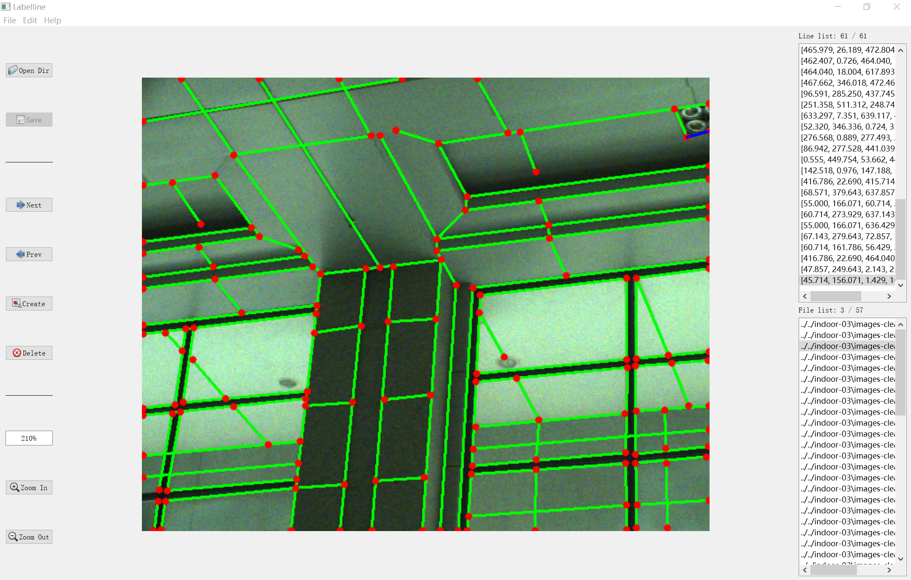

[](https://github.com/lh9171338/Outline) Labelline
===
This repository contains a line segment annotation tool for pinhole, fisheye, and spherical images, which is implemented with PyQt5.

## UI

<p align="center">
    
</p> 

## Requirements

* python3
* PyQt5
* numpy, glob, cv2, PIL, scipy, argparse, yacs, logging

## Dataset structure

    |-- dataset   
        |-- <image folder>
            |-- 000001.png  
            |-- 000002.png  
            |-- ...  
        |-- <label folder>  
            |-- 000001.mat  
            |-- 000002.mat  
            |-- ...  
        |-- <coeff folder>
            |-- 000001.yaml
            |-- 000002.yaml  
            |-- ...

## Usage
```
python Labelline.py --type <image type> [--coeff_file <coeff image>]
```
Please refer to [Usage.html](Usage.html) for more usage information.